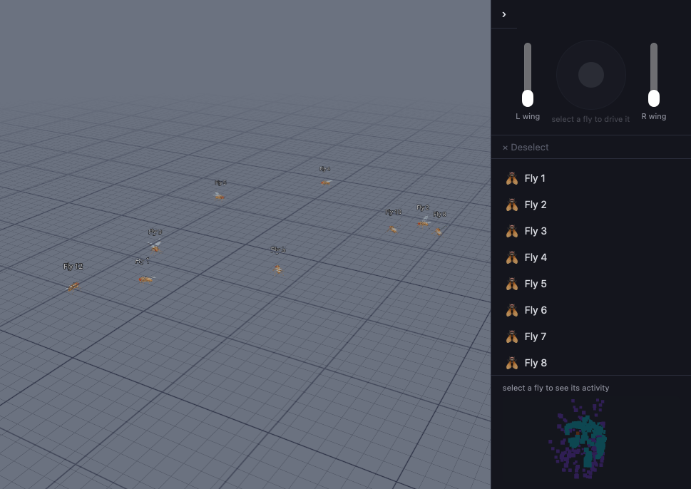
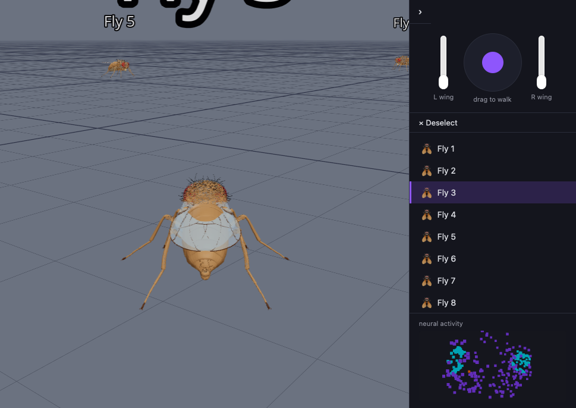
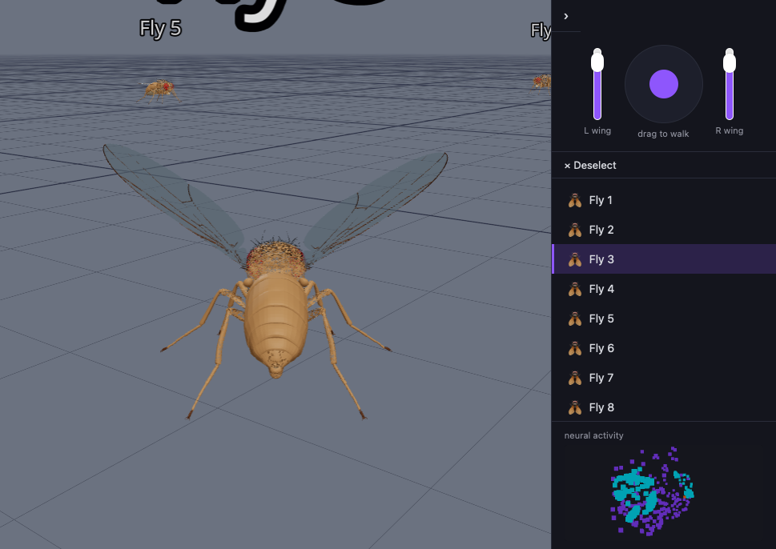
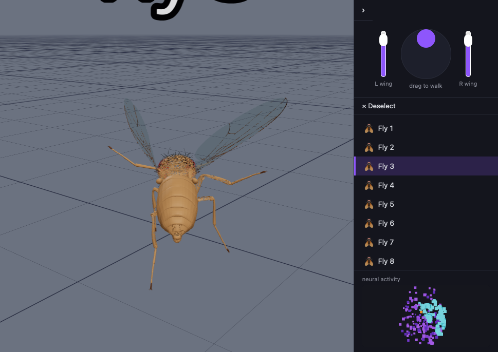

# flyyt

A fleet of fly-scale "robots" speaking [VDA5050](https://www.vda.de/en/news/publications/publication/vda-5050-de-en-fassung) — the AGV fleet-management wire protocol usually used for warehouse robots — rendered as an actual biomechanically-articulated 3D fruit fly swarm, each with its own small brain.

It's two things in one repo:

- A **VDA5050 fly-fleet simulator backend** (`backend/`): a drop-in alternative to [vda5050-sim](https://github.com/gpue/vda5050-sim) for testing VDA5050 tooling, but at millimeter scale with fly-shaped "AGVs" instead of full-size ones. Same wire protocol (order/instantActions in, state/connection/visualization out over NATS), same deploy shape.
- A **browser 3D visualizer + embodied-fly playground** (`frontend/`) that renders that fleet — or, with no backend at all, a fully self-contained "practice mode" of locally-simulated flies with a placeholder biological brain, vision, wing/leg control, and spatial audio.

Fully self-contained: no private registries, no private git dependencies, no external platform services required to build or run any of this.

## Screenshots

**Fleet overview** — a dozen flies scattered across the play area, each independently "alive" (idle brain activity, spontaneous small movements), labeled and selectable:



**Select a fly** to snap the camera into a heading-relative chase view behind it, unlock its joystick/wing controls, and start streaming its live neural activity as a point cloud in the side panel:



**Manual wing control** — independent left/right wing-hinge sliders pose the wings directly, layered underneath the brain's own flapping drive:



**Joystick driving** — dragging the joystick walks the selected fly with a procedural tripod gait (legs, not wheels) and turns the wingbeat/audio drive up:



Each fly also **buzzes** — Web Audio oscillators pitched by its own wingbeat drive, spatialized (stereo pan + distance falloff) by position relative to the camera, and amplitude-modulated by the actual flap phase rather than a flat tone, so a barely-moving fly pulses faintly instead of humming continuously. (Not screenshottable — turn your volume up and select a fly.)

## Architecture

```
┌─────────────────────────────┐        NATS (VDA5050 order/state/
│   frontend/ (browser)       │◄──────  connection/visualization) ───┐
│   React + Three.js viewer   │                                      │
│   + local fly simulation    │        REST (roster, map upload)     │
│   (brain / vision / gait /  │◄─────────────────────────────────────┤
│    wings / audio, all       │                                      │
│    client-side)             │                                      │
└─────────────────────────────┘                              ┌───────▼────────┐
                                                               │  backend/      │
        no backend reachable? --------------------------------► FastAPI +      │
        falls back to local random flies,                    │  NATS transport │
        joystick-only control, no fleet protocol              │  VDA5050 v3    │
                                                               └────────────────┘
```

- **`frontend/`** — Vite + React 19 + TypeScript, `@react-three/fiber`/`@react-three/drei` for the 3D scene. Every fly runs, client-side, every frame: a small placeholder leaky-integrate-and-fire "brain" seeded with real [FlyWire](https://flywire.ai/) connectome neuron IDs/positions (`flyBrain.ts`), a tiny offline-trained MLP turning a nearby fly's bearing/distance into a looming-escape wing response (`loomingPerception.ts`), a procedural tripod leg gait (`tripodGait.ts`) and wing-flap controller (`wingController.ts`), and per-fly spatial buzzing audio (`flyBuzz.ts`). See `frontend/README.md`.
- **`backend/`** (`flyyt-backend`) — FastAPI + NATS, implements the VDA5050 v3 wire protocol (order following, `downloadMap`/`enableMap`/`deleteMap` map lifecycle, connection/state/visualization telemetry) for a generated fleet of fly-scale robots. See `backend/README.md`.
- **`tools/`** — offline Python scripts: baking the [flygym](https://github.com/NeLy-EPFL/flygym) NeuroMechFly body into the GLB the frontend renders, baking real FlyWire neuron coordinates for the brain point-cloud, and generating/training the looming-response MLP.
- **`context.md`** — the longer-term research framing (executable FlyWire connectome + FlyGym embodiment); the current frontend brain/vision are explicitly-labeled placeholders with the same interface shape, not that research goal realized yet.

## Run it

**Frontend only** (no backend, no NATS — local practice mode: random flies, joystick-only control):

```bash
cd frontend
npm install
npm run dev
```

**Full stack** (real VDA5050 fleet, orders/maps drivable over NATS):

```bash
# NATS with its websocket listener enabled (frontend connects over WebSocket, backend over plain NATS)
cat > nats.conf <<'EOF'
websocket {
  port: 8080
  no_tls: true
}
EOF
docker run -p 4222:4222 -p 8080:8080 -v "$PWD/nats.conf:/etc/nats/nats.conf" nats:latest -c /etc/nats/nats.conf

# backend
cd backend
uv sync
uv run uvicorn flyyt_backend.main:app --port 8000

# frontend, pointed at the backend
cd ../frontend
VITE_FLYYT_API_URL=http://localhost:8000 VITE_NATS_WS_URL=ws://localhost:8080 npm run dev
```

**Docker** (builds the frontend and serves it + the API from one container):

```bash
docker build -t flyyt -f Dockerfile .
docker run -p 8000:8000 -e NATS_BROKER=nats://your-nats-host:4222 flyyt
```

See `backend/README.md` for how to send a VDA5050 order or upload a fleet map over NATS.

## Related VDA5050 projects

- [vda5050-sim](https://github.com/gpue/vda5050-sim) — the full-size-AGV simulator this backend mirrors the shape of. See `backend/README.md`'s "Scope" section for what this one deliberately doesn't implement (battery drain, fault injection, legacy protocol versions, zones/traffic control, MQTT standalone mode).
- The [VDA5050 specification](https://github.com/VDA5050/VDA5050) itself, for the wire protocol both simulators speak.

## Credits

The fly body mesh is derived from [flygym](https://github.com/NeLy-EPFL/flygym)'s NeuroMechFly v2 model (Apache-2.0). See `CREDITS.md`.
